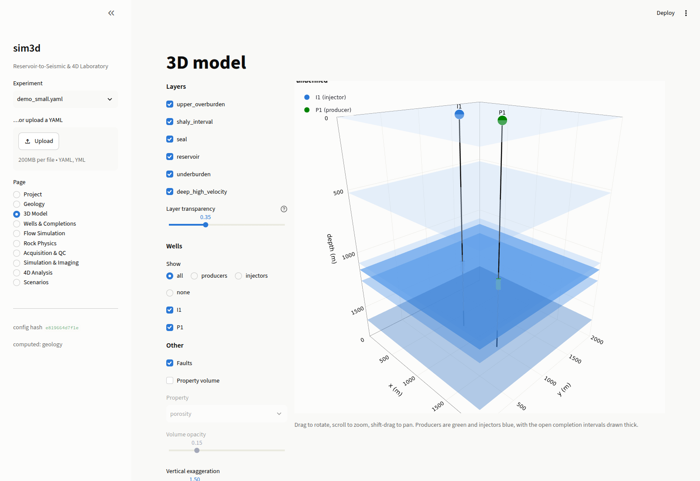
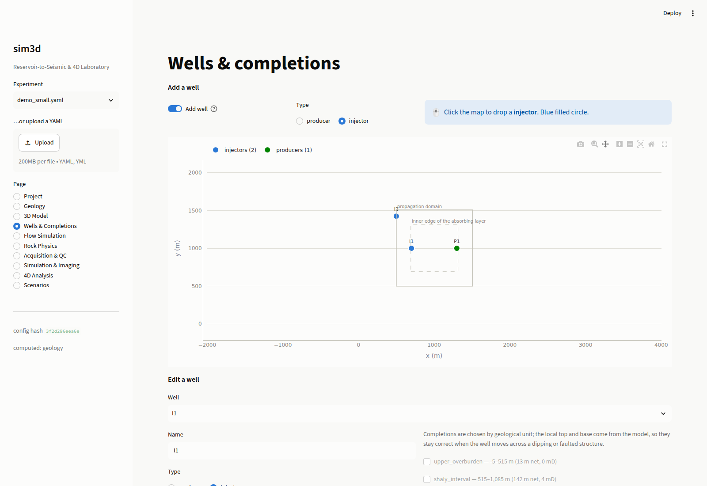
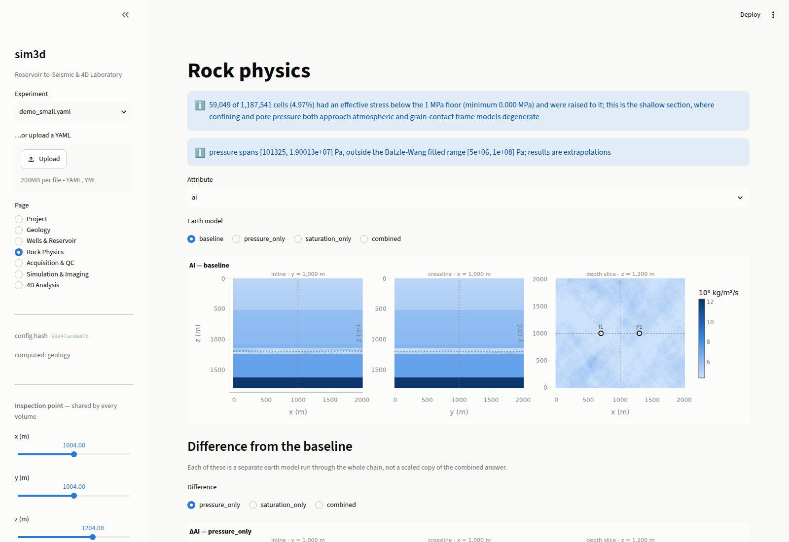
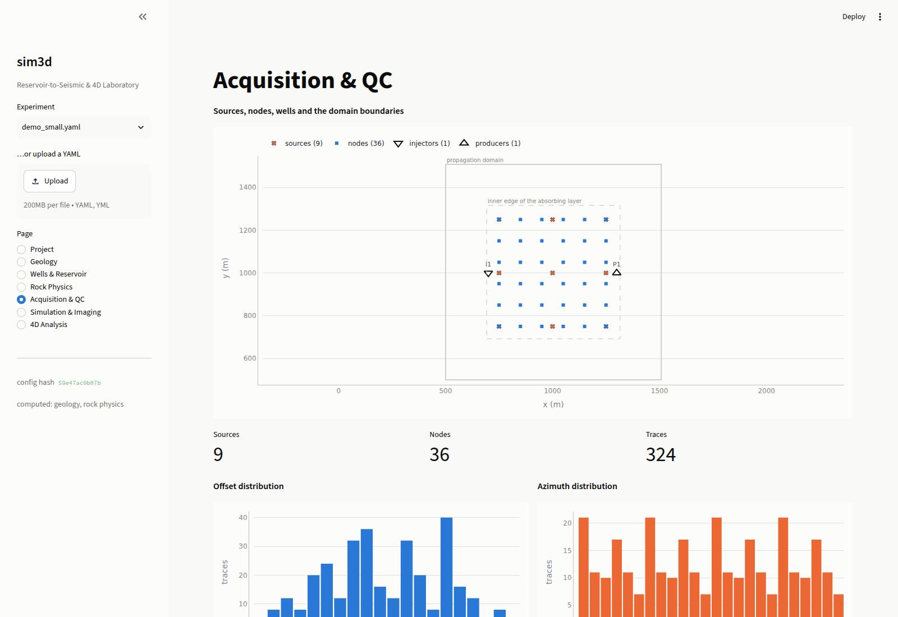
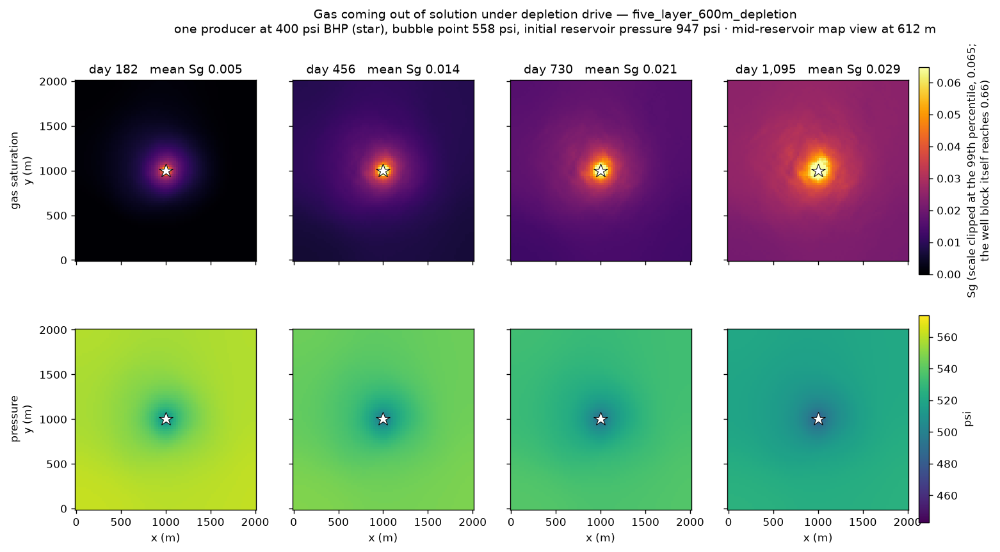
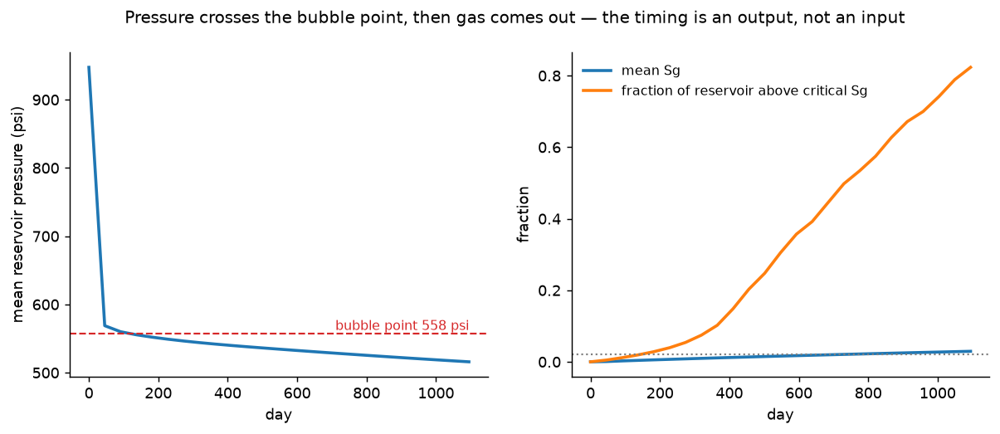
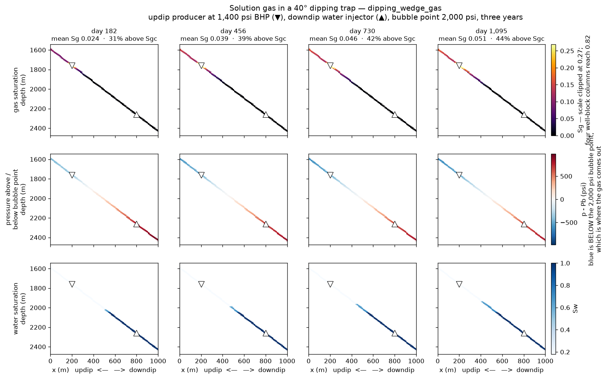
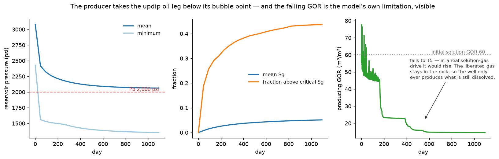
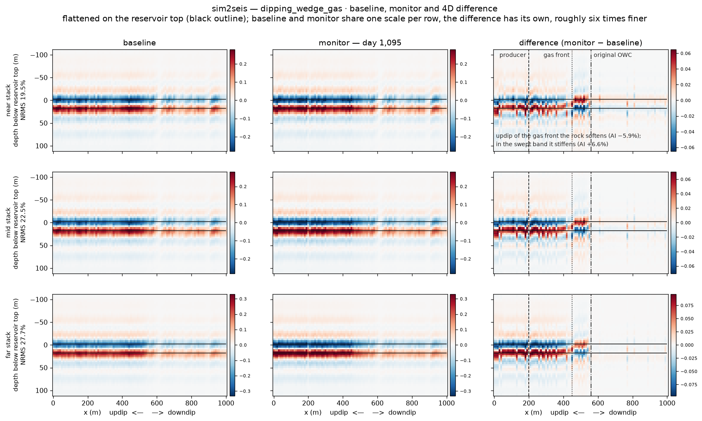
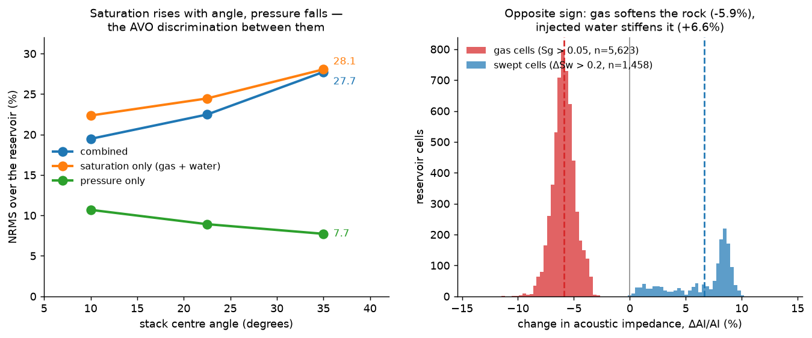

# 3D Mechanistic Reservoir-to-Seismic & 4D Inversion Laboratory

A research platform for asking mechanistic questions about 4D seismic:

> *Given a reservoir change I control exactly, what would I actually see on
> seismic — and could I tell pressure from saturation?*

The defining constraint is that the tool models the **physical seismic
experiment**. A seismic cube here is the output of wave propagation,
synthetic acquisition and migration — never of trace-by-trace convolution
of a reflectivity series.

```
reservoir physics → rock physics → wave physics → acquisition → imaging → 4D response
```

## The workflow

```
3D geological model
   → petrophysical properties
   → reservoir pressure and saturation state
   → rock-physics transformation
   → 3D Vp / Vs / density model
   → source excitation
   → 3D wave propagation through the full heterogeneous medium
   → receiver recordings (shot gathers)
   → 3D reverse time migration
   → migrated image
   → baseline / monitor comparison
   → 4D decomposition into pressure, saturation and interaction
```

### sim2seis — the model converted to seismic

```
3D earth model (Vp, Vs, density, per scenario)
   → angle-dependent reflectivity (Aki-Richards)
   → near / mid / far angle stacks
   → convolution down every column
   → synthetic seismic volume, in two-way time and in depth
   → baseline vs monitor differences, NRMS per stack
```

`sim3d sim2seis` converts the whole geological model into a synthetic
seismic volume, column by column, without propagating anything. Four earth
models in three angle stacks takes seconds. It is the cube a reservoir
study compares against real seismic, and the angle stacks are the point:
on `demo_small` the 4D response **falls** with angle for a pressure change
(8.2 → 6.3 % NRMS near to far) and **rises** for a fluid change
(8.0 → 8.1 %), which is the AVO discrimination between the two.

It is not, and cannot be, what a survey would record. Every trace is built
independently of its neighbours, so nothing moves sideways: no diffraction,
no multiples, no illumination, no migration — dipping structure is
mispositioned, and the stacks are constant-angle because a 1D column has no
offset axis to map from. A zero-angle stack equals the normal-incidence
convolution exactly, which a test pins.

### Two screening modes beside it

Neither propagates a wavefield, both are labelled everywhere they appear,
and neither may be presented as a seismic image. They exist so that many
rock-physics cases can be triaged cheaply before a handful go through the
full chain.

| mode | what it produces | cost on `demo_small` |
| --- | --- | --- |
| `sim3d preview` | the whole property cube filtered by the wavelet | 1.5 s |
| `sim3d synthetic` | **K vertical 1D traces** at chosen locations | 20 ms |
| `sim3d sim2seis` | **the full cube**, in angle stacks, all four scenarios | 8 s |
| `sim3d migrate` | the migrated image, from modelled gathers | ~10 min |

The sparse mode (`imaging.method: sparse_synthetic`) is the one to reach
for when the question is asked *at a well* — does the flood front show up
on the monitor survey at P1, and by how much. Its `synthetic.layout` puts
one trace per well by default, or spreads exactly `count` over the target,
or takes explicit `points`. A trace agrees with the full cube at the same
column, which is pinned by a test: if the cheap mode could disagree with
the expensive one, it would not be screening for it.

What a difference measured this way *is*: the 4D signal as the rock physics
put it into the vertical impedance profile. What it is not: the difference
a survey would record, because nothing here has been through an
acquisition geometry or a migration operator.

## Install

Python 3.10 or newer.

**Linux / macOS**

```bash
python3 -m venv .venv
.venv/bin/pip install -e ".[accel,ui,dev]"
source .venv/bin/activate          # optional: lets you drop the .venv/bin/ prefix
```

**Windows (PowerShell)**

```powershell
python -m venv .venv
.venv\Scripts\pip install -e ".[accel,ui,dev]"
.venv\Scripts\Activate.ps1        # optional: lets you drop the .venv\Scripts\ prefix
```

A virtual environment puts its executables in `bin/` on Unix and in
`Scripts/` on Windows. If `Activate.ps1` is blocked by the execution
policy, `Set-ExecutionPolicy -Scope Process -ExecutionPolicy Bypass` lifts
it for that window only and changes nothing machine-wide.

`accel` pulls in Numba, which makes the finite-difference kernels roughly
2.5× faster; `ui` pulls in Streamlit and Plotly for the GUI. Both are
optional — the engine and the CLI run without either. Forward slashes work in the
configuration paths on every platform, so the commands below need no
translation beyond the prefix.

## Try it

The commands assume an activated environment. If you would rather not
activate, prefix each one with `.venv/bin/` (Unix) or `.venv\Scripts\`
(Windows).

```bash
pytest -q                                            # 417 tests, ~75 s — the real proof
sim3d physics                                        # what each mode does and does not model
sim3d benchmark                                      # measure this machine
sim3d describe    examples/configs/demo_small.yaml
sim3d qc          examples/configs/demo_small.yaml   # the section 127 checks
sim3d rockphysics examples/configs/demo_small.yaml   # four earth models, ~15 s
sim3d plan        examples/configs/demo_small.yaml --benchmark
sim3d preview     examples/configs/demo_small.yaml   # 1D convolution cube
sim3d synthetic   examples/configs/sparse_synthetic.yaml  # K vertical traces
sim3d sim2seis    examples/configs/sim2seis.yaml       # the synthetic volume
sim3d run         examples/configs/demo_small.yaml   # everything, ~13 min on 4 cores
```

`sim3d rockphysics` is the best value for the time: the complete
four-scenario property decomposition and the interaction term, with no wave
modelling. Everything above it is free.

## Long migrations

`sim3d run` and `sim3d migrate` restart from nothing when they are
interrupted, which is fine on `demo_small` and useless on a survey that
takes hours. `examples/run_migration.py` writes every shot to disk as soon
as it exists, so an interrupted job resumes at the shot it stopped on.

```bash
pip install -e ".[accel,viz]"        # numba for speed, matplotlib for the PNGs

python examples/run_migration.py examples/configs/five_layer_600m_dense.yaml --check
python examples/run_migration.py examples/configs/five_layer_600m_dense.yaml \
    --out runs/dense --threads 32
```

`--check` runs the QC, estimates the cost and benchmarks the host, then
stops before propagating anything - run it first on a machine you have not
used before, because it reports that machine's wall time for the whole
experiment rather than a guess.

`--threads` is worth setting. Numba and the BLAS pools both size themselves
to the core count and then fight over it; two such jobs on four cores
measured a 13x slowdown here.

`--migrate difference` migrates only the 4D and costs half of the default
`both`; `--migrate baseline` adds the structural image. Either can be added
afterwards - the per-shot checkpoints make the second pass resume rather
than restart, and the result is identical to having asked for both at once.

Into `--out` it writes `images.npz`, a depth section and a map view per
scenario, an illumination panel, and the `fwd/` and `mig/` checkpoints.
Figures need matplotlib and nothing else - no browser, no display, no X
server - and `--no-figures` skips them.

There is no GPU backend. `compute.GPUBackend` raises rather than falling
back silently, and `--backend` rejects it for the same reason: the solver
allocates its fields with NumPy and does the CPML, the source injection and
the receiver gathers there too, so a backend accelerating only the two
derivative kernels would move the pressure field across PCIe six times per
timestep and lose to the CPU it replaced. What a big machine buys today is
cores.

### Under Slurm

`examples/slurm_migration.sbatch` is a working batch script:

```bash
sbatch examples/slurm_migration.sbatch
CONFIG=examples/configs/my_survey.yaml OUT=$PWD/runs/mine \
    sbatch examples/slurm_migration.sbatch        # override either
```

Three things in it are worth keeping if you write your own. It asks for
**one task and many cores** - the parallelism is shared-memory `prange`, and
`--ntasks=32` would start 32 copies of the experiment racing for the same
checkpoints. It asks for **no GPU**, which would otherwise idle for the
whole job. And it traps `USR1` from `--signal=B:USR1@600` to requeue itself
ten minutes before the wall clock runs out: `--requeue` alone covers
preemption and node failure but not `--time`, so without the trap a job too
big for one slot is simply cancelled. With the per-shot checkpoints it
finishes across as many slots as it needs.

`run_migration.py` reads `SLURM_CPUS_PER_TASK` for its thread count, so
`--threads` should be left off under a scheduler. Point `OUT` at a shared
filesystem rather than node-local scratch: a requeued job can land on a
different node, and the checkpoints are the whole point.

## The GUI

```bash
sim3d gui
```

Eleven pages — Project, Geology, 3D Model, Wells & Completions, Flow
Simulation, Rock Physics, Synthetic Volume, Acquisition & QC, Migration
Setup, 4D Analysis, Scenarios. Every volume is shown
as three orthogonal sections through **one cursor shared across every page**
(spec section 123), so the geological model, the property volumes and the
migrated image — which live on different grids at different spacings — are
always being inspected at the same place.

**The app sets experiments up and models what is cheap; it does not
migrate.** Flow, rock physics, sim2seis and the sparse vertical synthetics
all run here, in seconds to minutes, because none of them propagates a
wavefield. Full-wave modelling and RTM are hours of work, and a browser
session is not a batch queue: a page that blocks for four hours cannot
report progress honestly or survive a reload.

So **Migration Setup** produces a configuration rather than an image. Every
imaging, recording and scenario choice is made there, validated there —
geometry, operator sampling, cost — and written out as a complete YAML for
`examples/run_migration.py` to consume on whatever machine has the cores.
The page prints the exact command, for a shell and for `sbatch`. The
configuration can also be saved from the sidebar on any page.

**4D Analysis** reads the result back: point it at the `images.npz` a run
wrote and it renders the images against the same shared cursor, with NRMS
where a baseline was migrated. That is the whole loop — set up here,
propagate there, interpret here.



**Wells are placed with the mouse.** Turn on *Add well*, pick producer or
injector, and click the map. Producers are green, injectors blue, filled
circles, in map view, sections and the 3D scene alike. Select a well to
move, rename, retype or delete it, choose which geological units it is
open in, and set its control mode, rate and schedule.



Completions are chosen **by geological unit, never by typing depths**. The
local top and base come from the model, so a completion stays correct when
the well moves across a dipping or faulted structure — and moving a well
somewhere the unit does not exist fails loudly instead of perforating the
wrong rock.



Two behaviours matter more than the layout:

- **Expensive work never happens because a slider moved** (section 108).
  Dragging an injector's front radius updates the reservoir state and the
  rock physics — seconds — and marks the gathers and images stale. Full-wave
  modelling and RTM stay behind their own buttons, and the RTM button is
  disabled until gathers exist.
- **Changing the science invalidates the science** (section 109). The
  pipeline is keyed on the configuration's content hash, which covers every
  scientific input and excludes display settings. Edit a saturation target
  and the gathers are dropped; change a colour limit and nothing is.

Streamlit is only a frontend: every page calls the same `Pipeline` the CLI
drives, and a test asserts the UI package imports no solver, rock-physics
model or imaging routine directly.



Colour is assigned by the job it does, never by taste. Magnitudes
(porosity, Vp, impedance) use a single-hue sequential ramp; anything signed
— a 4D difference, a seismic amplitude, a pressure change — uses a diverging
ramp with a neutral midpoint and **symmetric limits**, because a signed
field on a one-sided scale hides its sign. There is no rainbow anywhere: it
invents boundaries the data does not have and is not colourblind-safe. The
categorical slots used for line identity were validated against the light
chart surface (worst adjacent CVD ΔE 9.1, normal-vision ΔE 22.9); two sit
below 3:1 contrast, so those charts carry a legend *and* direct end-labels
rather than relying on colour alone. The theme is pinned to light because
that is the surface the palette was validated against — a dark palette is a
set of steps chosen for the dark surface, not an inversion of this one.

`demo_small.yaml` is one injector and one producer 600 m apart, sized so the
whole chain — four independent earth models, full-wave modelling, RTM, and
the 4D decomposition — finishes in minutes. `research_standard.yaml` is the
real target: a 3 km model with a faulted anticline, two injectors and three
producers. `sim3d plan` reports it as VERY HIGH and quotes a runtime only
against a measured throughput.

## Reservoir flow

Two-phase IMPES on the reservoir cells: pressure implicit, saturation
explicit under a CFL limit, Corey relative permeabilities, harmonic
transmissibilities with fault multipliers, Peaceman wells on rate or
bottom-hole pressure. Material balance closes to 1e-10 of throughput and
cumulative oil is independent of the timestep to 0.02 %.

### Gas out of solution

`simulation.solution_gas: true` lets gas come out of solution where the
pressure falls below the bubble point — so **where and when it breaks out is
an output, not an assumption**. It was the one thing the two-phase model
could not answer: it would take a producer's pressure to any depth you liked
and report a gas saturation of exactly zero, because it had no gas phase to
put anything in, not because no gas came out.

Two conserved scalars per cell in standard volumes — stock-tank oil and total
gas — transported on the oil flux at the upstream solution GOR, then flashed:

```
Rs = min( G/N , Rs_sat(p) )          Sg = ( G - N Rs ) Bg(p) / Vp
```

The PVT comes from the same section the rock physics reads (`api`,
`gas_gravity`, `gor`, `temperature`), so the flow and the seismic cannot
describe different oils. `Rs_sat(p)` is Standing's bubble point solved for
the GOR rather than a second correlation, so the flow model and the
bubble-point QC check agree by construction.

The compressibility in the pressure equation becomes a field: below the
bubble point, gas coming out of solution and then expanding puts it around
1e-7 /Pa against the 4e-10 /Pa a dead oil carries. That is what makes a
solution-gas drive decline slowly instead of collapsing to the bottom-hole
pressure, and leaving it out does not perturb the gas saturation, it
determines it.

**The limit, stated rather than discovered.** Liberated gas does not flow
between cells — only a well can take it, and only above the critical gas
saturation. No gas cap forms, gas cannot segregate or cone, and the produced
GOR is capped near `Rs` at the well. That is fair while `Sg` stays under
`critical_gas_saturation` and increasingly wrong above it, so the run reports
the peak `Sg` it reached, says which regime it ended in, and reports how far
the hydrocarbon volume balance closed (mean over the field and worst cell,
because a well block is routinely two orders of magnitude worse than the
reservoir body). Past that, a black-oil simulator is the instrument, and this
is not one.

`examples/configs/five_layer_600m_depletion.yaml` is the same earth as
`five_layer_600m` under depletion drive instead of a balanced waterflood,
with a producer below the bubble point.



A gas halo growing outwards from the producer, under the pressure drawdown
cone that caused it. The colour scale is clipped at the 99th percentile
because the well block itself reaches Sg 0.66 — one cell column, and the
run says so rather than letting it set the scale.



The mean pressure falls 390 psi in the first 40 days on the compressibility
of a dead oil, then crosses the bubble point around day 100 and flattens: by
day 1,095 it has given up only another 40 psi. That knee is the gas, and it
is the reason the compressibility has to be a field. By the end, 82 % of the
reservoir carries gas above the critical saturation — which is also the run
telling you it has left the regime where its own assumption holds.

`examples/configs/dipping_wedge_gas.yaml` puts the same model in a
40° dipping trap with two wells — updip producer, downdip water injector.



Gas appears only where the pressure is below the bubble point: all 6,390
cells above the critical saturation are below it, at a mean 1,611 psi
against 2,414 psi where there is none. It fills the updip oil leg from the
crest down to x = 450 m while the injected water advances the other way,
from the contact updip to x = 400 m. The two fronts are about to meet, which
is the 4D discrimination question posed as a flow problem.



The right-hand panel is this model's own limitation drawn to scale. The
producing gas-oil ratio starts at the solution GOR of 60, lifts briefly
above it as the well takes free gas out of its own block, then falls to 15.
A real solution-gas drive does the opposite — the GOR climbs, often several
fold, as the liberated gas becomes mobile and is produced. Here the gas
stays in the rock, so the well only ever produces what is still dissolved,
and the curve runs backwards. That is the number to look at when deciding
whether this model or a black-oil one is the right instrument.

### What the seismic sees

`sim3d sim2seis` turns all four earth states into angle stacks in seconds.



Flattened on the reservoir top, because a 40° section otherwise spends nine
tenths of its area on rock nothing happens in. Baseline and monitor share a
scale; the difference needs one about six times finer. The 4D is confined to
the updip half — strong from the crest to the gas front at x = 450 m, a
band of opposite polarity where the injected water has swept, and
essentially nothing downdip of the original contact at x = 560 m.



Both independent physics checks pass. The saturation response **rises**
with angle (22.4 → 28.1 % NRMS near to far) and the pressure response
**falls** (10.7 → 7.7 %), which is the AVO discrimination between them on
the same earth with only the driver changed. And the two saturation effects
have cleanly opposite sign in impedance — gas softens the rock by 5.9 %,
injected water stiffens it by 6.6 %, with no overlap between the two
populations. Their field means very nearly cancel, which is why the
reservoir-wide mean 4D amplitude is 7e-5 against an RMS of 3.4e-2: on this
model a bulk average would report almost no change while a third of the
reservoir had gassed out.

The interaction term is 13.3 % and flat with angle, against a 27.7 %
combined response. That is large, and expected: Gassmann is strongly
nonlinear in gas saturation, so liberating gas at reduced pressure is not
the sum of liberating it and reducing the pressure.

Two things worth knowing about how that run was set up. The shipped
`dipping_wedge_4d.yaml` carries the library-default GOR of 100 m³/m³, whose
bubble point at 85 °C is 3,070 psi — against a reservoir spanning 2,427 to
3,724 psi. Exactly half of it starts below its own bubble point, at day
zero, while the baseline state carries Sg = 0 everywhere and no gas-oil
contact. The gas variant sets 60 m³/m³ so the oil is single-phase to begin
with. And on the original 2,250 STB/day rate control against VRR 0.98
injection, the producer settles at 2,132 psi and peak Sg is exactly 0.000 —
a voidage-balanced waterflood keeps the oil above its bubble point, which is
the correct answer and the reason the gas config draws the well down to
1,400 psi instead.

## What the platform will not do

The rule is **no silent degradation**. The software never quietly coarsens
the grid, lowers the bandwidth, shortens the record, drops shots, crops the
model or changes a physical parameter. When a request is not numerically or
computationally sound it says so and offers the alternatives:

```
$ sim3d qc examples/configs/research_standard.yaml   # after raising frequency to 20 Hz
FAIL    - [baseline] minimum wavelength (38.8 m at Vmin = 1861 m/s, Fmax = 47.9 Hz)
          is sampled at 3.88 cells; order 8 needs 5.25 for 1.0% phase error,
          i.e. dx <= 7.39 m

$ sim3d plan examples/configs/research_standard.yaml
This experiment is outside the resource budget:
  * cost class IMPRACTICAL exceeds the accepted VERY HIGH

Scientifically defensible alternatives:
  - reduce Fmax, which allows a coarser grid at the same dispersion tolerance
  - crop the propagation domain to a target window around the wells
  - increase the grid spacing, after checking the dispersion criterion
  - reduce the number of sources or use a sparser acquisition
  ...
```

Related rules the code enforces rather than documents:

- **Unknown configuration keys are errors.** A typo in `dry_frame_model`
  must not run with a default nobody chose.
- **Points outside the domain raise.** A receiver is never snapped to the
  model edge to make it fit.
- **A coarser imaging stride is refused,** not aliased.
- **Baseline and monitor share one time step.** Gathers on different time
  axes cannot be differenced; `common_dt()` pins it across all four models.
- **Runtime is only quoted against a measured benchmark.**

## Pressure/saturation separation

This is architecture, not a display option. Every baseline-to-monitor
comparison builds four *distinct physical earth models*:

| scenario | pressure | saturation |
|---|---|---|
| `baseline` | initial | initial |
| `pressure_only` | monitor | initial |
| `saturation_only` | initial | monitor |
| `combined` | monitor | monitor |

Each runs the complete rock-physics chain, its own forward modelling, its
own acquisition and its own migration. None is derived by scaling another.
`FourDStates.check_isolation()` asserts at construction that the
pressure-only case moved no saturation and vice versa.

That is what makes the interaction term meaningful:

```
ΔX_interaction = ΔX_combined − (ΔX_pressure + ΔX_saturation)
```

In property space it measures the nonlinearity of the rock physics alone.
In seismic space it measures that *plus* everything wave propagation and
imaging add. Comparing them is the point.

`sim3d run examples/configs/demo_small.yaml` (13 minutes, four earth models
each independently modelled and migrated) gives:

```
Property-space AI                 interaction / combined (RMS):  3.48 %
Seismic-space migrated amplitude  interaction / combined (RMS): 24.25 %

NRMS against the baseline image:
    pressure_only       0.74 %
    saturation_only     2.43 %
    combined            1.96 %
```

The seismic interaction is about seven times the rock-physics one. Almost
all of the departure from superposition is introduced *after* the rock
physics — by finite-frequency interference, illumination and the migration
operator — and no amount of care with Gassmann would have predicted it.
Note also that the combined NRMS (1.96%) is *lower* than the
saturation-only NRMS (2.43%): the pressure and saturation responses
partially cancel in the image. A workflow that scaled a single 4D
difference to separate them would report the opposite.

Two caveats on those numbers. This demonstration runs at 8 Hz with nine
shots, so it illustrates the *mechanism* rather than calibrating it; the
ratio will move with bandwidth, aperture and perturbation size. And the
interaction term includes whatever numerical noise the imaging leaves
behind, which at this sparsity is not negligible — the 4D null test
(identical baseline and monitor) is the control that bounds it.

## Layout

```
src/sim3d/
  core/          units, grids and the geology/propagation/target hierarchy,
                 configuration and hashing, cost planning, error policy
  compute/       backend abstraction: NumPy, Numba, and a GPU placeholder
                 that raises rather than silently falling back
  geology/       surfaces, faults, correlated random fields, facies,
                 the layer builder, seven templates
  wells/         wells, patterns, spacing diagnostics
  reservoir/     state invariants and the mechanistic pressure/saturation
                 generators
  rockphysics/   minerals and mixing, Batzle-Wang fluids, dry-frame models,
                 Gassmann, pressure substitution, the full chain
  acquisition/   OBN geometry, fold, offset and azimuth distributions
  wave/          FD scheme analysis, CPML, sources, the acoustic solver
  imaging/       RTM and its wavefield storage
  processing/    the two 1D synthetic modes, light filters
  fourd/         the four scenarios, decomposition, 4D metrics
  validation/    model QC and the physics transparency table
  experiments/   the pipeline the CLI and the GUI both drive
  io/            scenario persistence: definition, flow and seismic apart
  ui/            the Streamlit front end, its display components and the
                 3D scene
  cli.py
tests/           417 tests, ~75 seconds
examples/configs/
docs/
```

## Numerics

The solver integrates the first-order velocity–pressure acoustic system

```
∂v/∂t = −(1/ρ)∇p        ∂p/∂t = −κ ∇·v + s        κ = ρVp²
```

on a staggered grid, 8th order in space and 2nd order in time, with
unsplit CPML boundaries (Komatitsch & Martin 2007) and variable density —
so impedance contrasts, not only velocity contrasts, generate reflections.

Nothing about the grid is hard-coded. The stability limit comes from the
scheme's own eigenvalue bound and the sampling requirement from its fully
discrete dispersion relation, which replaces the folklore "8 cells per
wavelength" with an answer that depends on the operator **and** the Courant
number:

| spatial order | cells/λ at 1% error, at the CFL limit | spatial error alone |
|---|---|---|
| 2  | 10.99 | 12.81 |
| 4  | 5.56  | 5.08 |
| 8  | 5.25  | 3.32 |

At the stability limit the time-stepping error dominates, so raising the
spatial order past 4th buys little unless `dt` also drops. `sim3d qc` says
which regime you are in.

## Validation

Every benchmark compares against a closed-form solution, a published bound,
or a literature measurement — never against a stored output of this code.

**Wave propagation**
- Whole-space matches the analytic Green's function
  `p = ρ ṡ(t − r/V) / (4πr)` in **absolute amplitude to 5%** and arrival
  time to under one sample; spreading follows 1/r to 5%.
- Two-layer reflection traveltime within one cell of two-way time, and the
  normal-incidence coefficient `(Z₂−Z₁)/(Z₂+Z₁)` to 15% for both polarities.
- CPML leaves under 0.5% of peak amplitude behind; energy decays
  monotonically once the source is silent.
- FD operators converge at their nominal order; scatter and gather are
  verified adjoint, which RTM depends on.

**Imaging**
- RTM collapses a point diffractor to within **0.12 wavelengths**, with 52%
  of the image energy inside a sphere of 0.3 wavelengths occupying 1.4% of
  the analysed volume.
- A flat reflector images at the correct depth.

**Rock physics**
- Pure water at 20 °C comes out at **1482.4 m/s and 997 kg/m³** against
  measured 1482 and 998; seawater at **1520.3 m/s** against 1521.
- Hertz-Mindlin stiffens as P^(1/3) to nine digits.
- Gassmann round-trips through its own inverse to 1e-9.
- Mixing bounds order correctly — and one test records that VRH can sit
  *outside* the Hashin-Shtrikman bounds at 90% clay, since it is an
  estimate with no bound status.

```bash
pytest -q                    # 417 tests, ~75 s (includes the section 131 null test)
```

Unactivated, that is `.venv/bin/pytest -q` on Unix and
`.venv\Scripts\pytest -q` on Windows.

## Not implemented

Interfaces are designed for these; the physics is not there yet, and the
`sim3d physics` table says so at every run.

- **No free surface or water layer** — every face is absorbing, so there are
  no ghosts and no surface multiples.
- Elastic, anisotropic (VTI/TTI) and attenuating (Q) propagation.
- Kirchhoff migration, LSRTM, Born modelling, FWI.
- The inverse problem itself. This release builds the trustworthy forward
  engine that studying it requires, and stores the ground truth
  (ΔP, ΔSw, ΔSg, ΔVp, Δρ, ΔAI and every seismic difference) that a future
  inversion would be trained or tested against.
- **Black oil.** Gas comes out of solution (see *Reservoir flow*) but does
  not flow between cells, so there is no gas cap, no coning and no
  three-phase relative permeability. The flow model reports how far its
  volume balance closed rather than implying it closed.
- Marine streamer, OBC and land geometries; SEG-Y and RESQML I/O; the GPU
  backend.
- Geology is built from parametric templates, not drawn: dip, throw and fold
  amplitude are configuration values rather than surfaces you drag.
- Scenario comparison shows which settings differ and what would have to be
  rerun; it does not yet put two sets of results side by side.

## References

Batzle & Wang (1992) *Seismic properties of pore fluids*, Geophysics 57,
1396–1408 · Gassmann (1951) · Dvorkin & Nur (1996) *Elasticity of
high-porosity sandstones* · Mindlin (1949) · Mavko, Mukerji & Dvorkin
(2009) *The Rock Physics Handbook*, 2nd ed. · Berryman (1995)
*Mixture theories for rock properties* · Virieux (1986) · Levander (1988) ·
Graves (1996) · Komatitsch & Martin (2007) *An unsplit convolutional
perfectly matched layer…*, Geophysics 72, SM155–SM167 · Brie et al. (1995)
