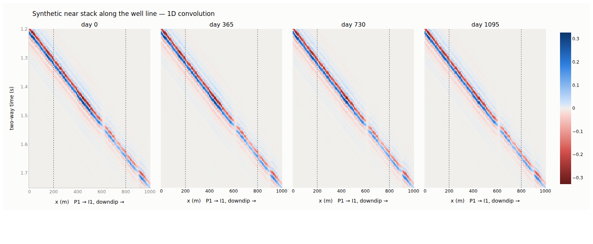
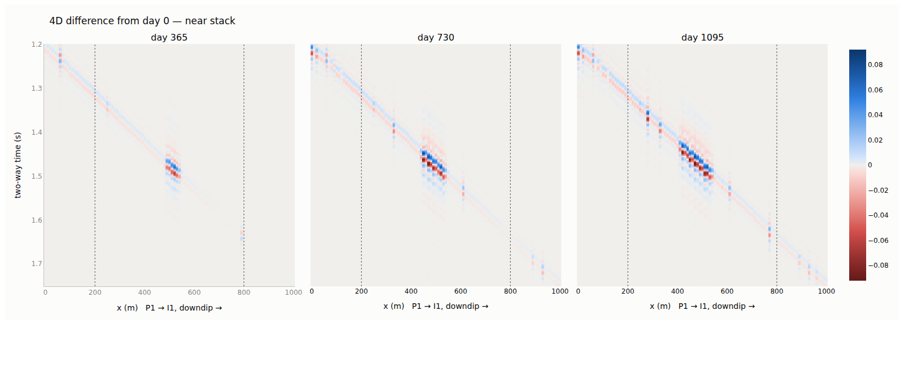
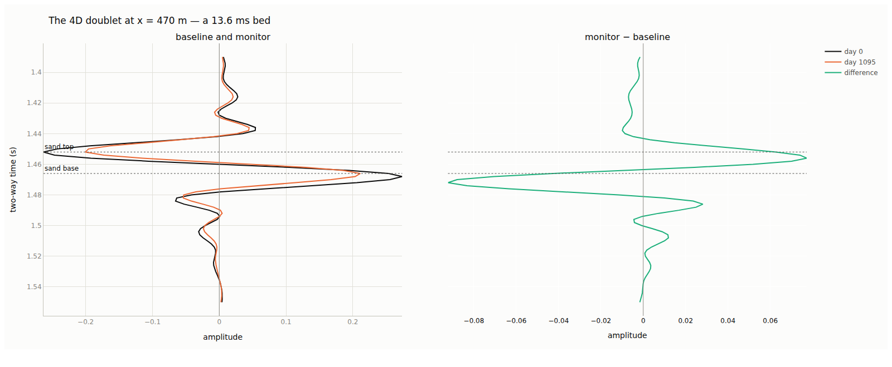
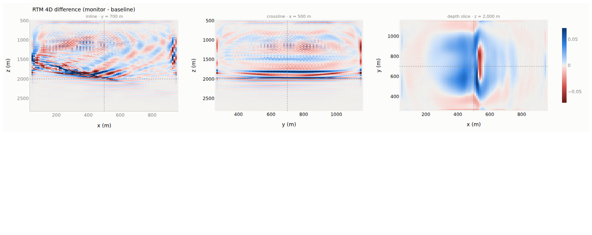
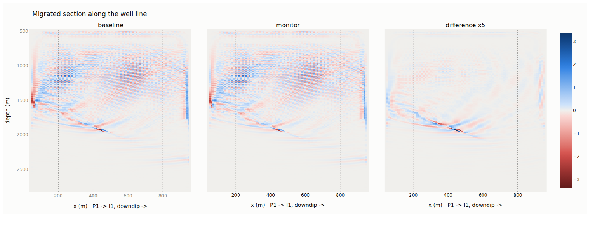

# A 40-degree dipping trap: downdip injection, updip production

A three-layer shale–sand–shale system dipping at 40 degrees, with the sand
crossing 2,000 m at the model centre, an oil-water contact cutting it, water
injected downdip into the water leg and oil produced updip, over three years.

## The model

| | |
|---|---|
| dip | 40 degrees, towards +x |
| sand | 20 m gross, crossing 2,000 m at x = 500 m |
| relief | 839 m over 1,000 m of dip length: sand runs 1,580 m updip to 2,420 m downdip |
| shales | semi-infinite above and below, so the only reflectors are the sand's own |
| OWC | 2,050 m, which cuts the sand at x = 560 m |
| transition | 15 m capillary ramp, Swirr 0.18 |
| P1 | updip at x = 200 m, sand at 1,748–1,768 m, oil leg |
| I1 | downdip at x = 800 m, sand at 2,252–2,272 m, water leg |
| duration | 1,095 days, monitor at the end |

## Three things the dip decided, before any physics

**The cell size is set by the dip, not by the seismic.** A bed of thickness
`g` dipping at `theta` drops `dx tan(theta)` per lateral cell, so adjacent
columns of it overlap by only `g - dx tan(theta)`. At 40 degrees with
`dx = 20` m and a 20 m bed that is 3 m, and on a 5 m vertical grid a third
of the column pairs shared no cell at all. The reservoir was a staircase of
disconnected blocks: both wells railed against their BHP limits inside a
year, produced and injected essentially nothing — and the material balance
closed to 4e-08, because nothing was conserved incorrectly. The fluid simply
had nowhere to go. Every symptom looked like a badly chosen rate.

`dx = 10` m and `dz = 4` m leave about three cells of overlap and every
adjacent column pair connected. `check_layer_connectivity` now measures this
and fails on it.

**A 20 m sand at 2,000 m is below tuning.** Vp in the sand is 2,597 m/s, so
at 30 Hz the wavelength is 87 m and the bed is a quarter of it. The top and
base do not resolve as two events; they interfere into one composite
wavelet. That is the physics of the model as specified, not a limitation of
the modelling.

**40 degrees is steeper than a 1D convolution can place.** sim2seis builds
every trace independently, so no energy moves sideways and a dipping
reflector is mispositioned by construction. The 4D *amplitudes* below are
still meaningful — they compare the same column against itself before and
after — but the structural position of the events is not, and only a
migration would fix that.

## What the rock physics does

One global dry frame is not a simplification here, it is a bias. With a
single soft-sand frame the shale comes out slower than the reservoir sand
and the top of the sand barely reflects at all. A stiff frame for the shale
restores it:

| | Vp |
|---|---|
| shale (stiff frame) | 3,102 m/s |
| sand | 2,597 m/s |

Soft sand under hard shale, so the top of the sand is a negative reflection
coefficient — the ordinary class of response for this section.

## The flow result

| | |
|---|---|
| P1, day 1095 | 2,250 STB/day oil, **no water**, BHP 1,968 psi |
| I1, day 1095 | 2,200 STB/day water, BHP 3,258 psi |
| material balance | 1.9e-12 over 288 timesteps |
| swept | 1,873 of 14,645 sand cells, max dSw 0.546 |

The injector sits in water, so every swept cell is the contact itself
moving. Averaging Sw over the sand in each column puts the oil-water
boundary at **x = 540 m at the start and x = 430 m after three years**: the
flood has pushed the contact 110 m updip, and the producer 230 m further
updip has not yet seen it.

### The water leg is fully wet, and getting there took two attempts

The saturation update used to clamp every cell into the Corey endpoints,
`[Swc, 1 - Sor]`. Residual oil is the oil a waterflood cannot displace; a
cell that never held oil has none to leave behind. Clamping the water leg
to `1 - Sor` therefore put 25 % oil saturation across the entire aquifer on
the first timestep, oil that was never in the model, and the flood then
removed it again over three years. In 4D that read as an impedance change
of **-413,000 in the water leg against the real flood's +412,000** - the
same size, the opposite sign - which inverted the polarity of the
difference everywhere downdip of the front and looked exactly like a
physical result.

The first fix was from the wrong end: initialise the water leg at `1 - Sor`
so the clamp has nothing to do. That makes the model self-consistent and
leaves every aquifer in the tool holding immobile oil, which is not a
property of an aquifer. The ceiling is per cell now, and never below where
the cell started, so a leg initialised at 1 stays at 1 while a swept oil
cell still stops at `1 - Sor`.

What it changed, and what it did not: the flow is almost untouched - 1,873
swept cells against 1,851, the same contact positions, the same well rates
to the psi - because the spurious oil was removed on the first step and
barely interacted with the flood. The *seismic* changed completely. The
combined near-stack NRMS falls from 23.15 % to 13.65 %: nearly half of what
was being reported as 4D signal was the aquifer relaxing out of a state the
initialisation should never have put it in.

## The 4D result

NRMS against the baseline, per scenario and angle stack:

| scenario | near | mid | far |
|---|---|---|---|
| pressure only | 8.61 | 8.12 | 7.81 |
| saturation only | 10.81 | 11.39 | 12.29 |
| combined | 13.65 | 13.54 | 13.65 |

Noise floor 4.65 % (6 % of signal RMS at 70 % repeatability), so every
number above is signal.

**The AVO separates the two causes, and in opposite directions.** The
saturation response *grows* with angle, 10.81 to 12.29; the pressure
response *falls*, 8.61 to 7.81. That is the discriminator the angle stacks
exist for: a far-stack difference that brightens is fluid, one that dims is
pressure. The combined stack is flat across angle - 13.65, 13.54, 13.65 -
which is not an absence of AVO but the two trends cancelling, and it is the
reason to carry the decomposition rather than the combined case alone.

A whole-volume NRMS is also a property of the volume you chose as much as
of the change you modelled: most of this cube is barren overburden, and
these figures are diluted by exactly that. They are comparable with each
other, and not with a number measured over a different volume.

**The time shifts are negligible and that is the useful finding.** The true
shift peaks at 1.07 ms and the windowed estimate recovers it to 0.38 ms
RMS. Aligning the monitor before differencing moves the combined near-stack
NRMS from 13.65 % to 11.55 % - a real but secondary correction. A 20 m
reservoir changes too little of the travel path to shift the section below
it, so this 4D is an amplitude signal almost entirely. On a thick or
compacting reservoir the same code gives the opposite answer: 6 ms of shift
alone manufactures 58 % NRMS.

## Figures

*The dipping package in section and map view. The sand runs 1,580 m updip
to 2,420 m downdip; the wells sit either side of the contact.*

*The synthetic near stack along the P1 -> I1 line at each survey date.*

*The same sections differenced against day 0. The anomaly tracks the sand
and its updip edge advances with the flood.*

Also in `figures/`: `wedge-01_project.png`, `wedge-03_model3d.png` and
`wedge-04_wells.png`, showing the configuration, the 3D view and the
completions resolved against the dipping sand.

## The flood through time, as a section between the wells

The wells share y = 700 m, so the P1 -> I1 line is a constant-y inline and
the section is a straight slice rather than an interpolated traverse. Four
surveys - day 0, 365, 730 and 1095 - on one shared time axis set by the
slowest of them, because each survey has its own velocity and so its own
deepest two-way time, and letting each end at its own would put the
monitors on axes the baseline cannot be subtracted from.

| day | the 4D anomaly | peak amplitude | flow contact |
|---|---|---|---|
| 365 | x = 490 to 530 m | 18.9 % | x = 500 m |
| 730 | x = 450 to 530 m | 27.5 % | x = 460 m |
| 1095 | x = 410 to 530 m | 28.2 % | x = 430 m |

*Anomaly: the contiguous run of traces whose 4D difference exceeds 10 % of
the baseline's peak amplitude. Peak amplitude: the largest 4D difference on
the section, as a percentage of that same baseline peak.*

**The anomaly is pinned at one end and advances at the other.** Its downdip
edge does not move: 530 m at every date, because that is where the contact
started and there is nothing to change downdip of it. Its updip edge runs
490 -> 450 -> 410 m, tracking the contact the flow simulation puts at
500 -> 460 -> 430 m - about 20 m ahead of it, which is the right direction
and the right size. A trace lights up as soon as *any* water enters the
column; the column-averaged contact needs half of it. Two calculations that
share no code, agreeing on the same front to within two cells.

**The peak grows and then saturates**, 18.9 % to 27.5 % to 28.2 %. The first
year is the anomaly filling in; after that, wherever the front has passed
the oil-to-water substitution is *complete*, so the amplitude change there
is maxed out and only the swept area grows.

There is also a single bright trace at x = 0 and one or two isolated ones
updip of the flood, at x = 280 and 330 m. They are the edge of the model
and the pressure response respectively, not the flood, which is why the
table quotes the contiguous run rather than a count of traces over a
threshold.

## Why the 4D difference is a doublet

One trace at x = 470 m, where the response is strongest:

| | AI |
|---|---|
| sand, day 0 | 4,997,368 |
| sand, day 1095 | 5,387,663 (+7.8 %) |
| shale just above | 7,223,683 |

Water hardens the sand - Sw goes 0.18 to 0.67 and impedance rises 7.8 % -
and the depletion helps in the same direction, since falling pore pressure
stiffens the frame. But the shale is harder still, so the top of the sand
is a *trough*, not a peak, and hardening the sand shrinks that contrast:

| | baseline | monitor | difference |
|---|---|---|---|
| sand top, 1.452 s | -0.263 | -0.200 | **+0.063, a peak** |
| sand base, 1.466 s | +0.242 | +0.206 | **-0.036, a trough** |

Opposite signs at the two interfaces, because a harder sand shrinks the
contrast at both - and the contrasts have opposite polarity to begin with.
The reflection coefficient at the top goes from -0.182 to -0.146.

They do not appear as two events because the sand is **13.6 ms thick**
two-way, far shorter than the wavelet. The two opposite-signed changes
interfere into a single doublet that is close to the wavelet's derivative
scaled by the bed thickness. That is a thin-bed impedance response, not a
time shift: the measured shifts peak at 1.07 ms, nowhere near enough to
produce this amplitude, and a shift would move both interfaces the same way
rather than opposite ways.

**Water makes a peak at the top, everywhere the flood has reached.** That is
worth stating because it was not always true here. Reading the difference
trace sample by sample at x = 470, 500 and 520 m - the swept section - each
one leads with a positive lobe of +0.077, +0.054 and +0.071, then a
negative one of the same size about 20 ms later. The only thing ahead of
the positive lobe is the Ormsby's own leading sidelobe, a tenth to a
quarter of its size, which is a property of the wavelet and not of the
flood. Downdip of about 550 m the response collapses to 2 % of the baseline
peak - the aquifer was already wet and nothing happened to it.

The record used to show a polarity flip at x = 520, trough-then-peak
downdip of the front. It was not physics. It was the manufactured oil in
the water leg being produced away, an impedance *decrease* where the real
flood gives an increase, and it reversed the doublet everywhere beyond the
front. The flip is gone with the clamp that caused it.

## The migration

It ran: 9 shots per survey, two surveys, on the isotropic 10 m grid at a
16 Hz Ricker.

| | |
|---|---|
| forward | 1,272 s |
| imaging | 2,835 s |
| total | ~68 min on an idle 4-core machine |
| memory | 3.56 GB, flat across all 18 shots |

The re-run on the corrected water leg took 158 min for the same work,
because a test suite and two analysis jobs shared the four cores. Two numba
jobs on four cores is the oversubscription trap this project has measured
before; the cost here was 2.5x, not the 13x the flow solver showed, but it
is the same mistake.

**NRMS depends entirely on where you measure it**, and this is the cleanest
demonstration of it in the project:

| window | 4D NRMS |
|---|---|
| the whole propagation domain | 7.92 % |
| reservoir window, x 270-730 m, z 1,700-2,400 m | **28.57 %** |
| the flood front, x 400-620 m, z 1,750-2,150 m | 28.45 % |

The whole-volume figure is diluted 3.6x by overburden that has no 4D change
in it at all. Only the windowed number means anything, and quoting the
whole-volume one next to a reservoir measurement would be comparing two
different questions.

It is also not comparable with the 13.65 % the sim2seis near stack reports.
Those differ in bandwidth (a 16 Hz Ricker against a 6-12-40-55 Ormsby), in
noise (the sim2seis cubes carry a 4.65 % floor, these images carry none) and
in domain (depth against time). The migration is here to put the reflector
in the right place, which a 1D convolution cannot do at 40 degrees; it is
not a second opinion on the amplitude.

**The dipping reflector is in the right place.** That is the whole reason to
pay for a migration here: the 1D convolution mispositions a 40-degree dip by
construction, and the migrated inline puts the 4D anomaly along the sand
where the flow simulation says the flood is, terminating updip near
x = 500 m rather than smeared across the section.

**The boundaries are not the problem.** Measured rather than assumed: the
same homogeneous model in a 600 m box against an 1,800 m reference box whose
faces are too far away for anything to return inside the record, so any
difference after the small box's first face echo *is* the boundary's
leakage.

| PML | thickness | max leak | RMS |
|---|---|---|---|
| 10 nodes (shipped) | 100 m, 0.79 wavelengths | 0.028 % | 0.009 % |
| 20 nodes | 200 m, 1.58 wavelengths | 0.004 % | 0.001 % |
| 30 nodes | 300 m, 2.37 wavelengths | 0.001 % | 0.000 % |

All three are negligible, and the shipped layer is already inside 0.03 % of
a domain with no boundary at all - despite being thinner than the usual
one-to-two-wavelength guidance. Doubling it would double the domain to
remove 0.024 % of an artefact.

**The near-field taper, sized properly.** `taper_wavelengths` defaults to 1
and `correlation_start_time` to the straight-down-and-back time at the
fastest velocity, so both were already on before any of this - the artefact
simply reaches further than one wavelength. At 126 m the shallow section
carried ten times the reservoir's RMS, because a raised cosine
`0.5(1 - cos(pi r/R))` suppresses by only 11 % at 100 m from a receiver. The
configuration now sets `taper_radius: 600.0`, and on this run the shallow
section measures 0.159 RMS against the reservoir's 0.111 - a ratio of 1.4,
where it was 9.9.

The taper is identical in both surveys and cannot reach the target -
receivers sit at 620 m and the sand inside the imaging window is below
1,790 m - so it changes the picture and no 4D measurement, which is exactly
what the function claims for itself.

**More shots would not fix the edges, and would fix the middle.** The nine
sources span x = 240 to 760 m; the image spans 40 to 960 m. The stripes down
the left and right of the section are outside the source carpet entirely,
so they are un-illuminated migration operator and no number of shots inside
that footprint touches them - only a wider survey would. Inside the
aperture it is the opposite: 260 m shot spacing against the operator-
aliasing limit `V/(4 f sin(theta))`, which at 2,597 m/s, 38.5 Hz and 40
degrees is 26 m, is a factor of ten too coarse, and the 40 m receiver
spacing is 1.5x too coarse. The smearing between the shots is aliasing, and
denser shooting is what removes it.

## What was not run

**A denser shot carpet.** Nine shots is what makes the interior of this
image noisy, and the fix is arithmetic: ten times the shots for the same
survey is ten times the forward modelling and ten times the imaging, so
about eleven hours on this machine instead of one. The image would be worth
it; the wall clock is the reason it is not here.

**The angle-stack decomposition on the migrated image.** The migration runs
`[baseline, combined]` only. Separating pressure from saturation costs
another two full surveys and does not need a migration to be meaningful -
that is what the sim2seis run is for, at a quarter of the compute.

**A depth-converted sim2seis section**, which would let the two modes be
laid side by side on one axis rather than compared through a table.
